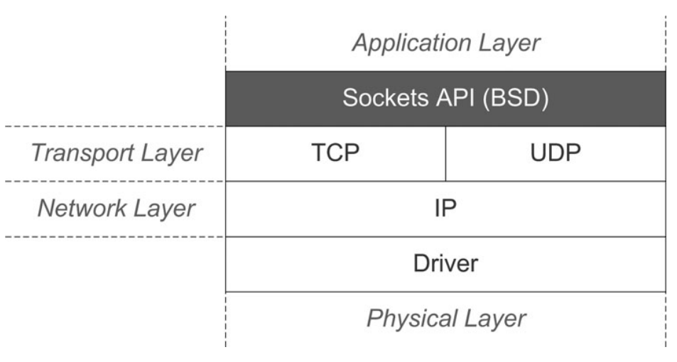
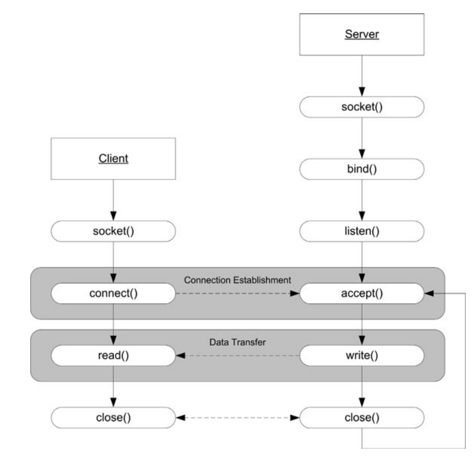

[TOC]
##Linux Application Programming Second Edition

### Application Development Topics

#### Introduction to Sockets Programming

##### Layered Model of Networking



* Port

  The port is the endpoint for a given process for a protocol. Ports are commonly called "bound" when they are attached to a given socket. Port numbers below 1024 are reserved for well-known service.

##### Client and Server application



1. Create a socket. Socket is the communication endpoint that is created by the *socket* call.
2. The server *bind* an address and port.
3. The server *listen* on the port and wait for client to *connect* it.
4. When a client *connects* to a server, the server *accepts* the connection. Then a new socket connection exist between the client and server.
5. Both the client and server can *send* and *recv* data asynchronously.
6. Finally, each side can *close* the connection asynchronously and the other side automatically receives an indication of the closure.

#### Select调用

#### POSIX Threads

The 2.6 kernel utilizes the new Native POSIX Thread Library, or NPTL (introduced in 2002), which is a higher performance implementation with numerous advantages over the older component. The numbers of threads in Linux Threads was a compile-time option(1000), whereas NTPL supports a dynamic number of threads. NPTL can support up to 2 billion threads on an IA-32 system.

check the pthread version of current system with : `$getconf GNU_LIBPTHREAD_VERSION`, this will output `NPTL 2.23` on  my ubuntu 16.04.

When a process is forked,  a new process is created with its own globals and stack. When a thread is created, the only new element created is a stack that is unique for the thread. The code and global data section are common between the threads.


A process can create and manage numerous threads. Each thread is identified by a thread identifier that is unique for every thread in a system. Because the data space is shared by threads,  they share more than just user data. Such as file descriptors for open files or sockets are shared too. So we have to handle the resources been access by multiple threads.

The author strongly suggest that using shared data while developing threaded applications.

All pthread API will return 0 for success but a positive value to indicate an error. 

##### Create a thread

```c++
int pthread_create( pthread_t *thread, pthread_attr_t *attr,
	void *(*start_routine)(void *), void *arg );
int pthread_exit( void *retval );
// get the handler of current thread.
pthread_t pthread_self( void );
int pthread_once(pthread_once_t* once_control, void (*init_routine)(void));
// one thread terminate another thread
int pthread_cancel( pthread_t thread );
```

`pthread_create`create a thread with `pthread_t` and a base function. The function `start_routine` represents the top level code that is executed within the thread. The `pthread_t` object mythread represents the new thread. We can use the fourth argument to send a value or a structure containing a variety of elements to the thread. The exit value presented to `pthread_exit` must not be of local scope; otherwise it won't exist after the thread is destroyed.

`pthread_once` function will help you to run some code only once, even it is called by different thread creation. This is useful when you want to initialize something for all thread. In the follow demo, we create two threads, and the thread function is called for twice while the `initialize_once_app` function is run only once.

```c++
#include <pthread.h>
#include <stdlib.h>
#include <stdio.h>
#include <string.h>
#include <errno.h>
#include <assert.h>

// init a mutex for pthread_once function
pthread_once_t my_init_mutex = PTHREAD_ONCE_INIT;

void initialize_once_app(void)
{
	printf("work only once\n");
}

void* EntryFunction(void* arg)
{
    printf("Thread %d ran~\n", (int)arg);

    pthread_t id = pthread_self();
    printf("my id is %x\n", (int)id);
    int detachid = 2;
    if (detachid == (int)arg)
    {
    	printf("I am thread %d and I must detached bye...", detachid);
    	pthread_detach(id);
    }

    pthread_once(&my_init_mutex, initialize_once_app);

    /* Terminate the thread */
    pthread_exit(arg);
}

int main()
{
	printf("start up...\n");

    int ret;
    pthread_t mythread1;
    pthread_t mythread2;
    int arg1 = 1;
    int arg2 = 2;
    
    ret = pthread_create(&mythread1, NULL, EntryFunction, (void*)arg1);
    printf("pthread_t is %x\n", (int)mythread1);

    ret = pthread_create(&mythread2, NULL, EntryFunction, (void*)arg2);    

    if (ret!=0)
    {
		printf("Can't create pthread (%s)\n", strerror(errno));
		exit(-1);
    }
    int status = 0;
    // wait for mythread run finished
    printf("wait for mythread 1 working \n");
    ret = pthread_join(mythread1, (void**)&status);
    if (ret!=0)
    {
    	printf("Error joining thread (%s)\n", strerror(errno));
    }
    else
    {
    	printf("Thread status = %d \n", status);
    }
    printf("mythread1 finished\n");
    
    getchar();

    return 0;
}
```

build the demo with a make file，Note also that you specify the -pthread option, which adds support for multithreading to the application (such as re-entrancy). The option also ensures that certain global system variables (such as errno) are provided on a per-thread basis.

```makefile
threadapp: thread_demo.o
	gcc -pthread -lpthread -o threadapp thread_demo.o

thread_demo.o: thread_demo.c
	gcc -pthread -c -o thread_demo.o thread_demo.c 
```

##### Thread Synchronization

`int pthread_join( pthread_t th, void **thread_return );`

The **creator thread** can wait for the **created thread** to finish using this function. When `pthread_join` is called, the creator thread  suspends until a join is complete. When the join is done the caller receives the joined thread's termination status as the return from `pthread_join` A thread is automatically joinable when using the default attributes of `pthread_create`. If the attribute for the thread is defined as detached, then the thread can’t be joined (because it’s detached from the creating thread). 

`int pthread_detach( pthread_t th );`

The creator or the thread itself can detach itself. When the detached thread exits, all resources are immediately freed.

In the demo, the main thread will wait for the mythread1 finished. The mythread1 will return the arg value is 1 to the main thread.

##### Thread Mutexes

A mutex is a variable that permits threads to implement critical sections. These sections enforce exclusive access to variables by threads, which is left unprotected result in data corruption.互斥锁用来保护一段重要的代码段不被其他线程访问，从而避免一个数据同时被多个线程修改。A critical section is a section of code that can be executed by at most one process at a time. The critical section exists to protect shared resources from multiple access.

初始化一个互斥锁 `pthread_mutex_t myMutex = PTHREAD_MUTEX_INITIALIZER`，锁的种类有三种，默认为fast mutex.

```
PTHREAD_MUTEX_INITIALIZER Fast mutex
PTHREAD_RECURSIVE_MUTEX_INITIALIZER_NP Recursive mutex
PTHREAD_ERRORCHECK_MUTEX_INITIALIZER_NP Error-checking mutex
```

The recursive mutex is a special mutex that allows the mutex to be locked several times (without blocking), as long as it’s locked by the same thread. Even though the mutex can be locked multiple times without blocking, the thread must unlock the mutex the same number of times that it was locked. The error-checking mutex can be used to help find errors when debugging. Note that the _NP suffix for recursive and error-checking mutexes indicates that they are not portable.

当你已经有一个互斥锁变量后，就可以使用这个变量对一段代码块进行加锁。

```c
int pthread_mutex_lock( pthread_mutex_t *mutex );
int pthread_mutex_trylock( pthread_mutex_t *mutex );
int pthread_mutex_unlock( pthread_mutex_t *mutex );
int pthread_mutex_destroy( pthread_mutex_t *mutex );
```

All errors returned from `pthread_mutex_lock` and `pthread_mutex_unlock` are assertable (not recoverable). therefore, you use the return of these functions to abort your program.

如果一个互斥锁已经被锁了，trylock函数不会阻塞，你可以通过判断返回值来做一些其他的事情。

```c
ret = pthread_mutex_trylock( &cntr_mutex );
if (ret == EBUSY) {
/* Couldn’t lock, do something else */
} else if (ret == EINVAL) {
/* Critical error */
assert(0);
} else {
/* Critical Section */
ret = thread_mutex_unlock( &cntr_mutex );
}
```

记得使用destory函数来销毁一个锁。

```c
ret = pthread_mutex_destroy( &cntr_mutex );
if (ret == EBUSY) {
/* Mutex is locked, can’t destroy */
} else {
/* Mutex was destroyed */
}
```

一旦你成功对一段代码锁上了，就可以放心的修改这段代码中的数据，不用担心数据同时被其他线程修改。被加锁的代码片段要尽可能的短少，正如critical section名字所表达的，它是一个非常重要的区域，制作关键的事情，因为其他线程此时被阻塞会影响程序整体性能。

##### Thread Condition Variables

线程的条件变量可用于一个线程在达到某种条件后唤醒另一个线程。使用互斥锁的方式，一个线程要执行一段代码需要不停的去获取锁，再检查条件是否满足，然后释放锁，如果条件不满足，就会存在多余重复的不停加锁和解锁操作，影响程序性能。

```c
int pthread_cond_wait( pthread_cond_t *cond,
pthread_mutex_t *mutex );
int pthread_cond_timedwait( pthread_cond_t *cond,
pthread_mutex_t *mutex,
const struct timespec *abstime );
int pthread_cond_signal( pthread_cond_t *cond );
int pthread_cond_broadcast( pthread_cond_t *cond );
int pthread_cond_destroy( pthread_cond_t *cond );
```

创建一个条件变量:`pthread_cond_t recoveryCond = PTHREAD_COND_INITIALIZER;`

一个条件变量需要一个互斥锁和它关联起来，因此还需要`pthread_mutex_t recoveryMutex = PTHREAD_MUTEX_INITIALIZER;`在错误处理线程函数中，循环检测当前的负载是否超过阈值，如果没有超过线程就一直等待条件变量。由于`pthread_cond_wait`函数每次进入时会对mutex变量先解锁，函数退出时又会自动加锁，因此在`pthread_cond_wait`外面需要对mutex变量先加锁，再解锁。内部的while循环用来确保判断等待的条件是否满足。

```c
/* Fault Recovery Thread Loop */
while ( 1 ) {
	assert( pthread_mutex_lock( &recoveryMutex ) == 0);
	while (workload < MAX_NORMAL_WORKLOAD) {
		pthread_cond_wait( &recoveryCond, &recoveryMutex );
	}
	/*————————*/
	/* Recovery Code. */
	/*————————*/
	assert( pthread_mutex_unlock( &recoveryMutex ) == 0);
}
```

发送条件满足的信号，`pthread_cond_signal`通知等待条件变量的线程可以继续工作了，broadcast通知所有等待条件变量的线程，第一个收到通知的线程结束等待，并拿到锁，执行它的任务，然后另一个线程再拿到锁，执行它的任务。所有的线程都能收到条件变量的通知。收到条件变量的多个线程之间时串行的，因为wait结束执行都要拿到互斥锁mutex。

```c
pthread_mutex_lock( &recoveryMutex );
pthread_cond_signal( &recoveryCond );
//pthread_cond_broadcast( &recoveryCond );
pthread_mutex_unlock( &recovery_Mutex );
```

支持超时时间的条件变量等待，当时间到了后，函数返回调用者继续执行，通过判断返回值ETIMEDOUT来判断是否时超时导致的线程继续执行。

```c
struct timeval currentTime;
struct timespec expireTime;
int ret;
...
assert( pthread_mutex_lock( &recoveryMutex ) == 0);
gettimeofday( &currentTime );
expireTime.tv_sec = currentTime.tv_sec + 1;
expireTime.tv_nsec = currentTime.tv_usec * 1000;
ret = 0;
while ((workload < MAX_NORMAL_WORKLOAD) && (ret != ETIMEDOUT) {
	ret = pthread_cond_timedwait( &recoveryCond, &recoveryMutex,
					&expireTime );
}
if (ret == ETIMEDOUT) {
	/* Timeout — perform timeout processing */
} else {
	/* Condition met — perform condition recovery processing */
}
assert( pthread_mutex_unlock( &recoveryMutex ) == 0);
```

不要忘记条件变量的销毁

`pthread_mutex_destroy( &recoveryCond );`这个函数会检测当前的变量是否还有线程在等待。

```c
#define MAX_CONSUMERS (10)
long countVariable = 0;
pthread_mutex_t cond_mutex = PTHREAD_MUTEX_INITIALIZER;
pthread_cond_t condition = PTHREAD_COND_INITIALIZER;
// 生产者每创建一个任务就通知消费者处理一个
void *producerFunc(void* arg)
{
	int ret = 0;
	double result = 0.0;
	printf("producer started\n");
	for (int i = 0; i < 30; ++i)
	{
		ret = pthread_mutex_lock(&cond_mutex);
		if (ret == 0)
		{
			printf("producer create work (%d)\n", countVariable);
			countVariable++;
			pthread_cond_broadcast(&condition);
			pthread_mutex_unlock(&cond_mutex);
		}

		for (int i = 0; i < 600000; ++i)
		{
			result = result + (double)random();
		}
	}

	printf("producer finished\n");
	pthread_exit(NULL);
}

void *consumerFunc(void* arg)
{
	int ret;
	//you won’t ever join with the creating thread
	pthread_detach(pthread_self());

	printf("Consumer %x: Started\n", pthread_self() );

	while(1) {
		assert(pthread_mutex_lock( &cond_mutex ) == 0);
		assert( pthread_cond_wait( &condition, &cond_mutex ) == 0);
      	printf("Consumer %x: recv condition\n", pthread_self());
      	// assume that work is available as the condition is broadcast to all threads
		if (countVariable)
		{
			countVariable--;
			printf("Consumer %x: Performed work (%d)\n", pthread_self(), countVariable);
		}
		assert(pthread_mutex_unlock(&cond_mutex)==0);
	}

	// never executed, because the thread is cancel by the creator
	printf("Consumer %x: Finished\n", pthread_self() );

	pthread_exit( NULL );
}

int thread_conditon_demo()
{
	pthread_t consumers[MAX_CONSUMERS];
	pthread_t producer;

	// spawn the consumer thread
	for (int i = 0; i < MAX_CONSUMERS; ++i)
	{
		pthread_create(&consumers[i], NULL, consumerFunc, NULL);
	}

	// spawn the producer thread
	pthread_create(&producer, NULL, producerFunc, NULL);

	// wait for the producer thread
	pthread_join(producer, NULL);
	// wait for all the consumer finish their work
	while((countVariable>0));

	// cancel and join the consumer threads
	for (int i = 0; i < MAX_CONSUMERS; ++i)
	{
		pthread_cancel(consumers[i]);
	}

	pthread_mutex_destroy(&cond_mutex);
	pthread_cond_destroy(&condition);

	return 0;
}
```

The design of multithreaded applications follows a small number of patterns (or models). The master/servant model is common where a single master does outwork to a collection of servants. The pipeline model splits work up into stages where one or more threads make up each of the work phases.

##### re-entrancy

One topic that’s important to discuss in multithreaded applications is that of re-entrancy. Consider two threads, each of which uses the strtok function. This function uses an internal buffer for token processing of a string. This internal buffer
can be used by only one user at a time, which is fine in the process world (forked processes), but in the thread world runs into problems. If each thread attempts to call strtok, then the internal buffer is corrupted, leading to undesirable (and unpredictable) behavior. To fix this, rather than using an internal buffer, you can use a thread-supplied buffer instead. This is exactly what happens with the thread-safe version of strtok, called strtok_r. The suffix _r indicates that the function is
thread-safe.

###Debugging and Test

####Advanced Debugging

#####Memory Debugging
* Invalid use of a freed buffer
* Buffer overruns
* Memory leaks

######Valgrind:  
* memwatch of [Valgrind](http://valgrind.org/) suite. 

Valgrind works as CPU emulator, so the test application will slow by 20 or 30 times.

* intall `sudo apt-get install valgrind`
* compile our application with `-g`. like `g++ -g -o test test.cpp`
* using valgrind to run the application `valgrind --tool=memcheck ./test`
* profile an application's cache usage. `valgrind --tool=cachegrind ./test`

This utility details both instruction and data cache usage for the Level1 and Level2 caches. This is extremely useful for profiling cache usage to improve it for greater performance.

######Electric Fence(not recommend)
Electric Fence helps you detect two common programming bugs:

* software that overruns the boundaries of a malloc()memory allocation,
* software that touches a memory allocation that has been released by free().
* Unlike other malloc() debuggers, Electric Fence will detect read accesses as well as writes, and it will pinpoint the exact instruction that causes an error.

Electric Fence uses the virtual memory hardware of your computer to place an inaccessible memory page immediately after (or before, at the user's option) each memory allocation. So it will make our program to run slower with more memory. 

* install `sudo apt-get install electric-fence`
* using: link the library into your application `gcc -o test test.c -lefence`

######yamd
[yamd](https://www.cs.hmc.edu/~nate/yamd/) is a malloc debugging utility.  
Using `~$yamd-gcc test.c` to build our program and generate an executable called `a.out`. Execute the file `./a.out` will show the information.

######mtrace
mtrace just parse a trace file that is collected during the execution of an instrumented program. To instrument your program, add mtrace() function to log malloc and free calls. The mtrace is used in GNU libc, so if you are using GNU libc, it's ready to using.
```
#include <mcheck.h>

int
main (int argc, char *argv[])
{
#ifdef DEBUGGING
  mtrace ();
#endif
  …
}
```

######Custom but dangerous
think about using allocators.
* override the new/delete operator / malloc()/free() function.
* manage the allocated memory with a link-list
```
struct ALLOC_MEM_INFO
{
    DWORD pre;     // address of the pre memory
    DWORD next;    // address of the next memory
    DWORD stack[8];  // call stack to malloc 
};

```
The memory will malloc like 
FLAG + using_size + ALLOC_MEM_INFO + FLAG

######Others
[Memory debugger](https://en.wikipedia.org/wiki/Memory_debugger) on Wikipedia.

#### 时间处理

1. 将系统第一次开机以来的tick数保存在EEPROM中
2. 每次修改时间时，将最新的绝对时间和tick数保存EEPROM中
3. 系统时间通过RTC来保证正常运行，每次开机时从RTC中读取最新的时间

* 举例

保存系统绝对时间和第一次开机以来的绝对tick的变量分别为absTime和absTick

系统应用使用的时间为sysTime，同时有一个变量sysTick维护本次开机以来的tick数

sysTime每次开机时从RTC中读出来，而sysTick从开机后就一直每秒增加1.

当用户修改时间时，将sysTime设置为用户设置的时间，同时将它的值保存到RTC中。与此同时，需要将最新的绝对时间也更新保存到EEPROM中，最新的绝对tick数absTick = baseOffsetTick+sysTick.其中baseOffsetTick的值在第一次开机时为0。每次开机初始化时baseOffsetTick = 上次保存的absTick+（当前系统时间减去上次保存时间经过的秒数），因为设置时间时会同时设置RTC中和EEPROM中的时间，因此正常情况下EEPROM中的时间值肯定时小于RTC的，通过将RTC中的系统时间减去EEPROM中的绝对时间，就可以得到上次保存时间到这次开机经过的秒数，从而计算出第一次开机到现在本次开机经过的秒数。当系统中需要唯一的全局绝对Tick数时，就可以通过absTick = baseOffsetTick+sysTick得到。

1. 第一次开机时间为15:00 此时absTime为0,absTick也为0，用户需要设置系统时间为15:00,因此将设置sysTime为15:00并将其更新到RTC中，同时将absTime保存为15:00,absTick为本次开机经过的tick数，即0+sysTick，假设此时tick为200
2. 在经过1个小时后，即16:00时，用户将时间又修改为14:00，此时sysTime和absTime都为16:00,absTick=0+200+3600=3800s
3. 用户关机了一个小时，重新开机时，读取EEPROM中的上次保存的absTick和absTime，由于此时保存在RTC中的sysTime经过一个小时变成了15:00,因此计算本次开机时的baseOffsetTick=上次保存的绝对tick数+关机过程中经过的tick数=absTick+（sysTime-absTime）=3800s+3600s = 7400s，因此从第一次开机到此次开机时刻的绝对tick数就为7400s
4. 当系统需要使用全局绝地tick时，就通过本次开机时的绝对tick+本次开机到现在的系统tick数，absTick = baseOffsetTick+sysTick得到。