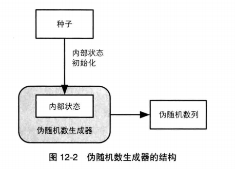
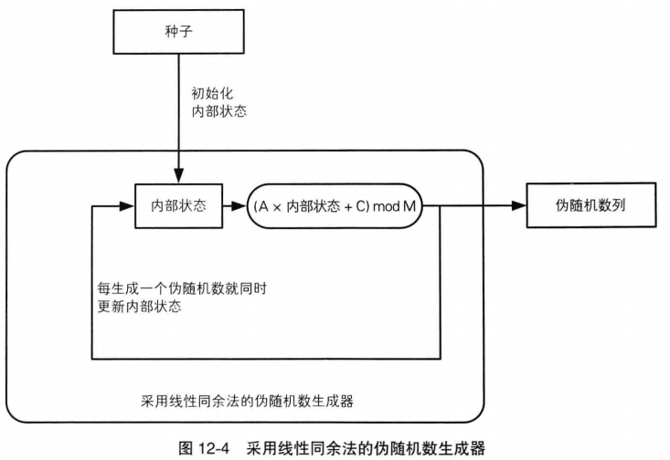
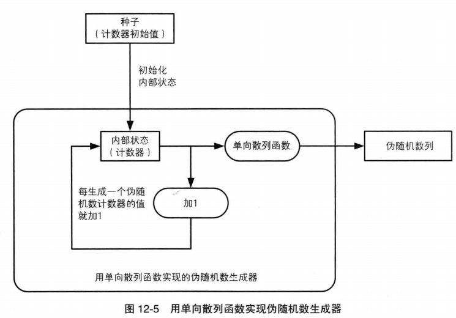
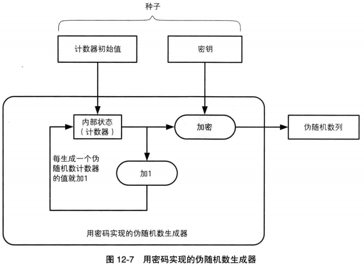
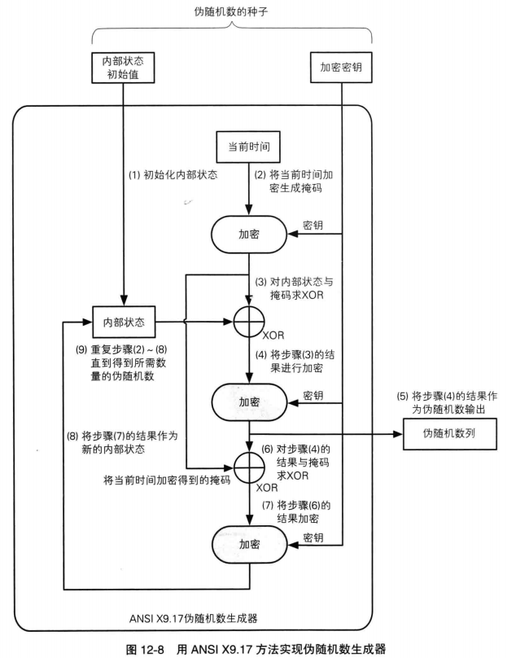

#图解密码技术 （日）结城浩

## 12 随机数--不可预测性的源泉

### 随机数的作用
* 生成密钥：对称密码和消息认证码
* 生成密钥对：公钥密码和数字签名
* 生成初始化向量(IV)：分组密码的CBC/CFB和OFB模式
* 生成nonce：防御重放攻击以及分组密码的CTR模式
* 生成盐：基于口令的密码(PBE)

### 随机数的性质
* 随机性(弱伪随机数)：不存在统计学偏差，是完全杂乱的数列
  判断一个伪随机数是否随机的方法称为随机数测试。

* 不可预测性(强伪随机数)：不能从过去的数列推测出下一个出现的随机数
  如果攻击者知道伪随机数生成算法，但是如果他不知道随机数种子，他也无法预测下一个生成的随机数，这就是不可预测性。

* 不可重现性(真随机数)：除非将数列本身保存下来，否则不能重现相同的数列

  仅靠软件时无法生成具有不可重现性的随机数列的。软件只能生成伪随机数列，因为计算机本身仅具备有限的内部状态，在内部状态相同的情况下，软件必然能生成相同的数。首次出现重复之前的数列的长度称为周期，软件生成的数列其周期必定时有限的，只是这个周期可能很长。

  如果要生成不可重现的随机数列，需要从不可重现的物理现象中获取信息，例如周围的温度和声音的变化，用户移动的鼠标位置信息，键盘的输入时间间隔。

这三个属性越往下越严格，具备上面的性质，不一定具备下面的性质，但是如果具备下面的性质，则一定具备上面的性质。只有满足了不可预测性的随机数才能用于密码学，因为密钥不能被攻击者看穿。

通过硬件生成的随机数列，是根据传感器收集的热量/声音的变化等事实上无法预测和重现的自然现象信息来生成的。这样的设备就是随机数生成器(Random Number Generator, RNG)。而软件无法生成真随机数，因此称为伪随机数生成器(Pseudo Random Number Generator, PRNG)。

### 伪随机数生成器
伪随机数生成器具有“内部状态”，并根据外部输入的种子来生成伪随机数列。

伪随机数生成器的内部状态是指生成器管理的内存中的数值。当需要生成一个随机数时，生成器根据内存中的值使用随机数算法计算得到一个随机数，为了保证下一个随机数是随机的，生成器需要改变自己内部的状态这样下一次会生成一个不同的随机数。

种子是用来对内部状态进行初始化的，随机数生成算法时公开的，但是种子时保密的，这样攻击者无法预测下一个随机数。

#### 线性同余法

线性同余法(linear congruential method)是一种随机数生成算法，但是它不能用于密码技术。计算方法为：

`Rn=(A*Rn-1 + C) mod M`

计算R0时，使用`R0=(A*种子 + C) mod M`计算，后续都用上一个随机数计算下一个，即最近一次生成的随机数作为当前的内部状态。

对于已知的算法A/C/M的值已知，攻击者在得到一个随机数后，自己就可以预测出下一个随机数的值，因此线性同余法是可预测的，不能用于密码技术。攻击者实际可以根据生成数列反向计算出A/C/M的值。

#### 单向散列函数法
使用单向散列函数如SHA-1作为生成算法，由于算法的单向性，攻击者无法根据已知的随机数列推出内部状态，也就无法预测下一个随机数。

这种方法第一次使用种子初始化内部状态，并用单向散列函数计算出散列值，散列值作为随机数输出。同时内部计数器加1,更新内部状态。由于攻击者无法知道内部状态，除非他能破解单向散列函数。

#### 密码法
使用加密算法如AES或RSA密码来计算出伪随机数列

这种方法和单向散列函数相似，只是用密钥加密内部状态值，计算出生成的随机数。ANSI X9.17伪随机数生成器结构如下：

步骤2将当前事前进行加密得到一个掩码，每次生成这个掩码都会更新
其中3-5输出伪随机数，把内部状态和掩码进行异或，并用密钥加密后得到随机数
6-8更新内部状态，用上一次的随机数与掩码进行异或并用密钥加密得到新的内部状态

* 为了避免随机数被攻击，种子非常重要，因此需要使用真随机数作为种子。但是一般不会到了用的时候才生成真随机数，而是事前在一个随机数池的文件中积累随机比特序列。当需要种子时，从这个随机池中取出所需长度的随机比特序列来使用。因此我们要保护随机数池这个没有意义的信息。