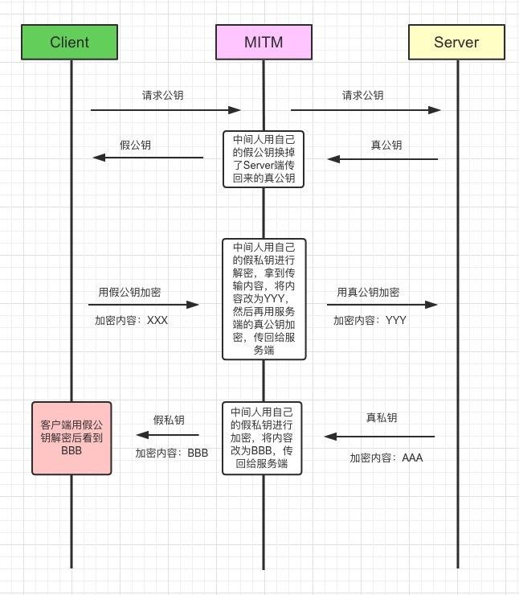
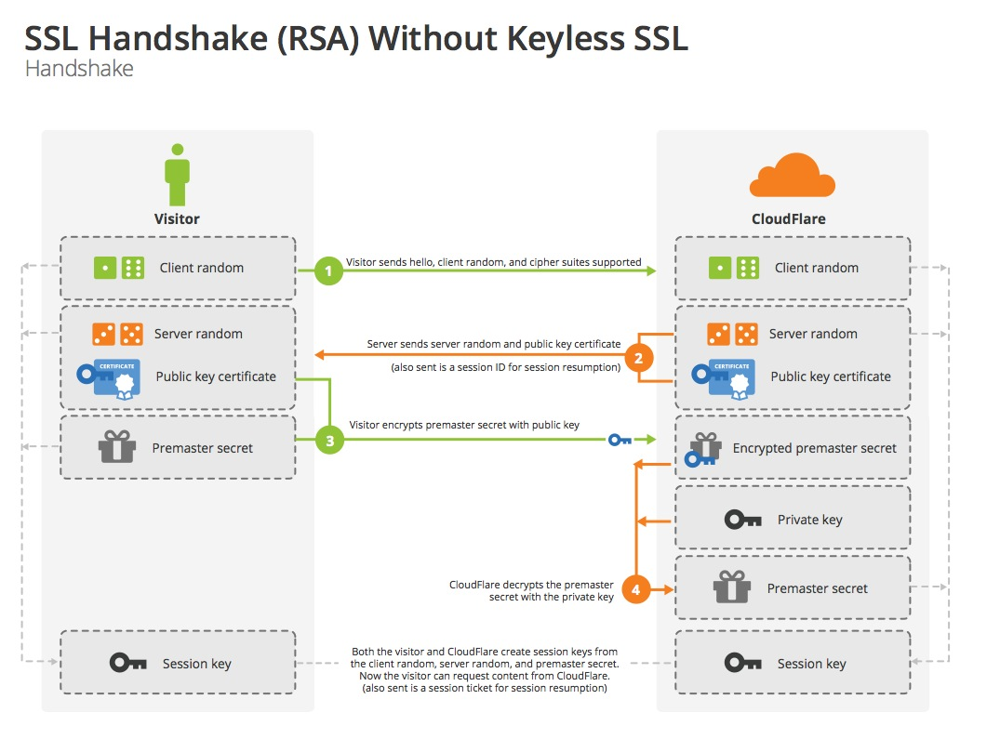
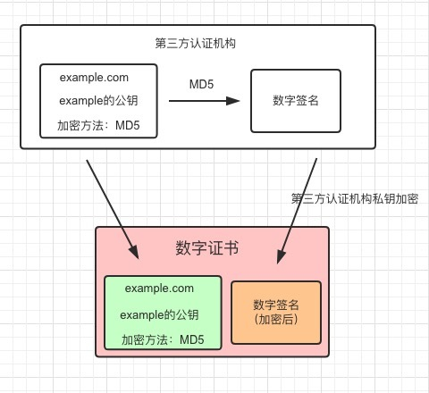
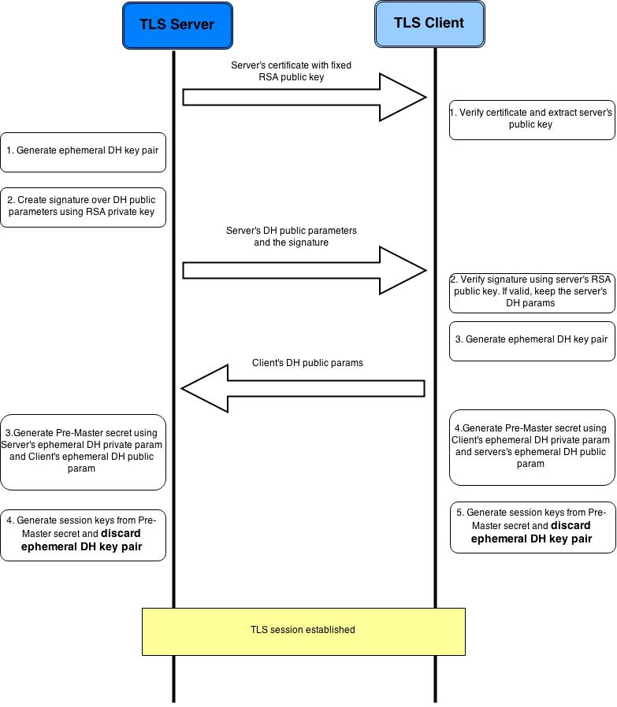
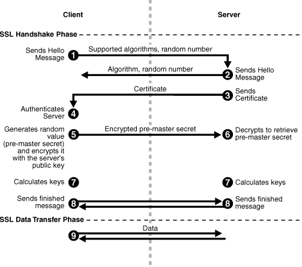

## HTTPS SSL TLS

### 对称加密

客户端和服务端使用相同的密钥对数据加密，当服务端对多个客户端时，服务端需要和每一个客户协商使用的密钥。

### 非对称加密

服务端保留自己的私钥，把自己的公钥公开出去给所有的客户端。服务端使用私钥加密数据，客户端使用服务端的公钥解密数据。

#### 中间人攻击(Man-in-the-Middle Attack)

https://segmentfault.com/a/1190000014954687?



### SSL

SSL是网景提出的网络安全层

### TLS

Transport Layer Security是标准化后的SSL协议

TLS1.0 == SSL3.1

TLS1.1 == SSL3.2

TLS1.2 == SSL3.3

### HTTPS

Http over TLS

* 网络架构


* TLS Record Protocol 保证数据的完整性
* TLS Handshaking Protocols  实现身份认证
* HTTPS只是比普通的HTTP通信在开始阶段多了握手协商key的过程，后续正常内容的传输使用对称加密算法，提高传输效率


#### 握手过程



1. 客户发送`hello`,客户端随机数`Client random`以及客户端支持的加密协议方法列表
2. 服务器应答服务端随机数`Server random`、服务器公钥证书以及服务器协定使用的加密算法
3. 客户端使用CA的公钥验证服务器的证书真实性，并把证书中的服务器公钥取出来，再使用这个公钥加密一个随机数`Pre-master secret`发给服务端
4. 服务端使用自己的私钥解码得到客户端发来的`Pre-master secret`
5. 客户端和服务端分别使用加密算法根据`Client random`、`Server random`和`Pre-master secret`计算得到一个`Session Key`，在后续的通信过程中使用这个`Session Key`作为密钥对传输的数据进行加密，这个过程是对称加密方式，由于`Session Key`由两端使用相同的算法和数据各自计算出，所以不需要传输密钥，解决了对称加密算法需要传输密钥的问题。


### 证书 (Digital Certificate)

#### 内容

- 证书信息：过期时间和序列号
- 所有者信息：姓名、公司、域名
- 所有者公钥

#### 证书验证

客户端收到服务端的证书后需要验证证书就是访问的服务端发的，避免有第三方冒充发送假证书。签名可以验证证书的来源是真实的。

### 签名 (Digital Signature) 

图示举例 http://www.youdzone.com/signature.html

签名可以理解为B给女朋友G写信，写完信的正文后，B在最后签上自己的名字，从而G可以判断这封信的确是B写给她的，而不是其他人冒充的。同时通过比较两次摘要信息相同，可以确保传输内容没有被修改过。

B在写完正文后，

```
1. 正文--哈希--> 摘要
2. 摘要--B的私钥加密--> B的签名
3. (正文+B的签名) 一起发送给G
```

G收到信息后，

```
1. 正文--哈希--> 摘要
2. B的签名--B的公钥解密--> 摘要 
3. 比较两个摘要是否相同
```

其中，G用B的公钥可以解密签名，就可以说明数据是B签名的，因为只有B私钥才可以生成签名。如果两个摘要的内容是相同的，说明数据没有被修改过。

但是如果G拿到的B的公钥是假的第三者M的，但她以为还是B的公钥，此时M就可以用M的私钥得到签名冒充B，给G发信息了。

CA机构是为了解决B的公钥的真实性的第三方机构。

### 证书颁发机构 (Certificate Authority )

CA一般是公开的机构，他的公钥是对外公开的，而且一般客户端浏览器中也内置了一些大的CA的公钥。由于他的公钥是公开的，因此别人无法假冒他的公钥了，因为客户端可以查到真实的公钥。例如CA告诉全世界我的公钥是5566，那么第三方就不能用自己的公钥5556来冒充CA了，因为大家都知道CA的公钥是5566.


1. CA对B的公钥和B的基本信息进行签名后生成B的一个B的公钥证书
2. G本地有受信任的CA的证书。G使用本地信任的CA的证书里的CA的公钥来验证B发来的公钥证书的签名真实性，先确保这个证书是CA签发的。
3. 如果签名的确是CA的，则G再验证证书内容没有被修改过，从而可以放心使用B的公钥证书中的B的公钥

[信任链](https://en.wikipedia.org/wiki/Chain_of_trust)(Chain Of Trust) G信任CA，CA信任B，从而G信任B

CA使用一个hash算法例如MD5对认证的B信息进行加密签名，从而避免证书内容被其他人修改。




### Diffie–Hellman算法

除了RSA算法，还可以使用Diffie-Hellman算法产生密钥


####  使用DH算法握手


#### D-H算法握手实际过程




### TLS Record Protocol

- 在发送端：将数据（Record）分段，压缩，增加[MAC](https://en.wikipedia.org/wiki/Message_authentication_code)(Message Authentication Code)和加密
- 在接收端：将数据（Record）解密，验证MAC，解压并重组

Record首先被加密，然后添加MAC（message authentication code）以保证数据完整性 

Record Protocol有三个连接状态(Connection State)，连接状态定义了压缩，加密和MAC算法。所有的Record都是被当前状态（Current State）确定的算法处理的。 

```
empty state -------------------> pending state ------------------> current state
             Handshake Protocol                Change Cipher Spec
```

初始状态（Empty state）没有指定加密，压缩和MAC算法，因而在完成TLS Handshaking Protocols一系列动作之前，客户端和服务端的数据都是**明文传输**的；当TLS完成握手过程后，客户端和服务端确定了加密，压缩和MAC算法及其参数，数据（Record）会通过指定算法处理。 

### 总结




https://segmentfault.com/a/1190000014954687?

https://cattail.me/tech/2015/11/30/how-https-works.html

https://blog.cloudflare.com/keyless-ssl-the-nitty-gritty-technical-details/

